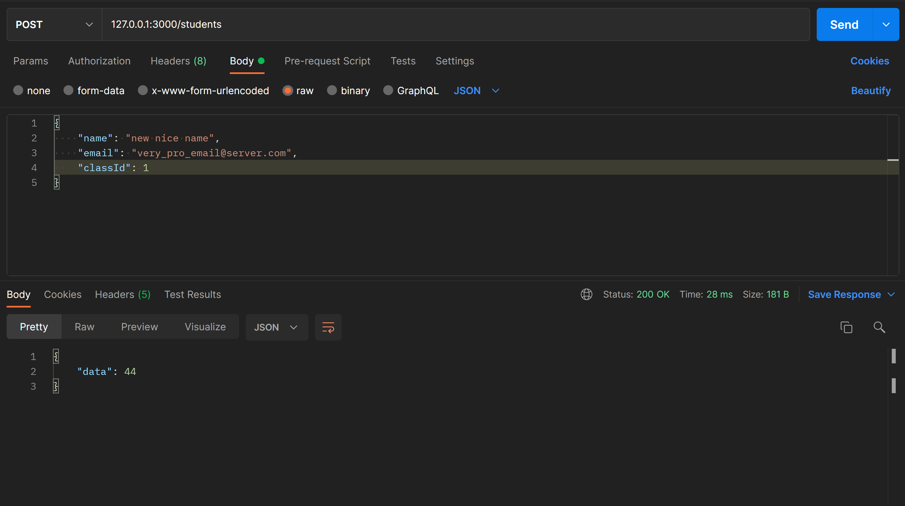

# NodeJS Fastify MySQL
Test project using Node with Fastify for routing and MySQL database.

## Tools needed
- NodeJS,  
- MySQL local server (I use XAMPP),
- POSTMAN or cURL or similar to test the endpoints,
- Coffee?
- Your emotional support animal?

## How to use/test/play with it?

1. clone/download the project,  
2. run ```npm install``` in order to have all the packages needed,  
3. in the root folder, create a ```.env``` file which will contain your database connection information (user, password, etc.):
```SERVER_PORT=3000
   DB_HOST=YOUR_HOST
   DB_USER=YOUR_USERNAME
   DB_PASSWORD=YOUR_PASSWORD
   DB_NAME=DATABASE_NAME
   DB_PORT=3306
```  
4. uhm, I will add a file that will create a database, if it's not here yet, make yourself one 😀 (sorry I forgot about it) 
5. once everything is set up, open terminal and type ```npm run dev```. This will start the server and will use Nodemon to restart it after any changes in the files.
There is also ```npm run start``` but it will only start the server once and will require manual restarting after any changes.  
6. don't forget to start MySQL.

### What does it do so far?
Well, at the moment there are only a few endpoints created.  

- ```GET 127.0.0.1:3000/``` will just return a basic message. Does not require DB connection to work.
- ```GET 127.0.0.1:3000/students``` will return an array with an object for each student from the database (limited at 20 results atm),   
- ```GET 127.0.0.1:3000/students/{id}``` will return an object for the student with the specified id (replace {id} with id number like 32), 
- ```POST 127.0.0.1:3000/students``` will add a student to the database and will return the id of the newly added student.  

For testing the ```POST 127.0.0.1:3000/students``` endpoint, I used POSTMAN like you see in the image below. Basically what you have to do
is pass a JSON in the Body with the data for that student. This will normally come from a form or similar.  
  

#### To be continued . . .


